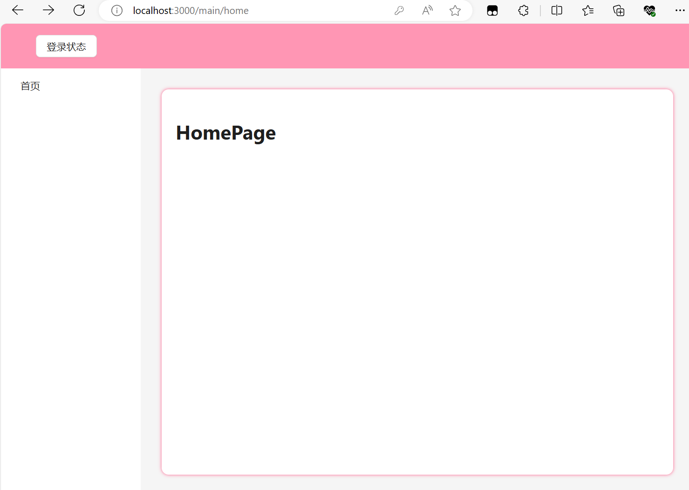
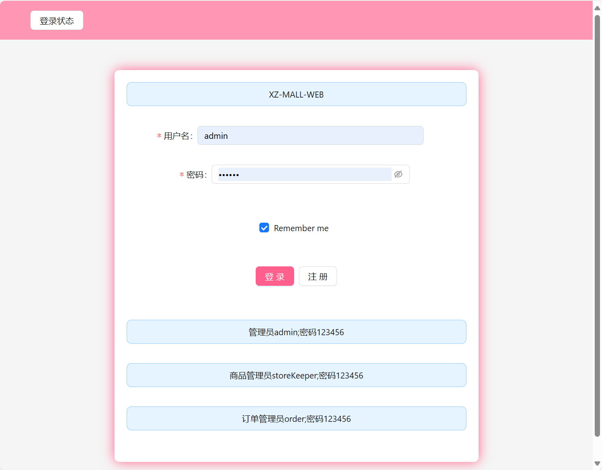
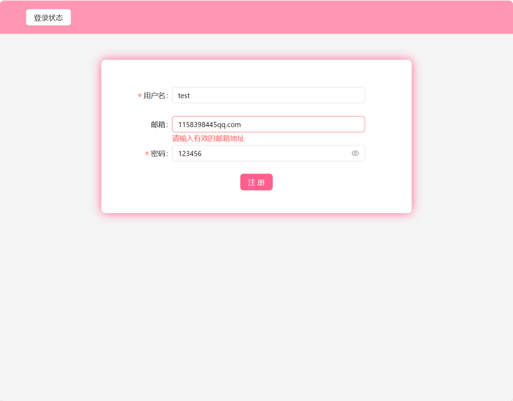
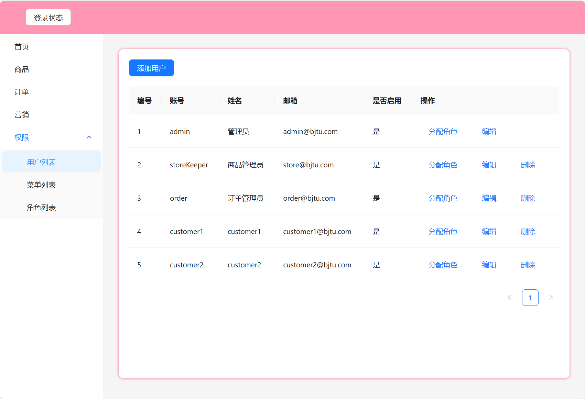
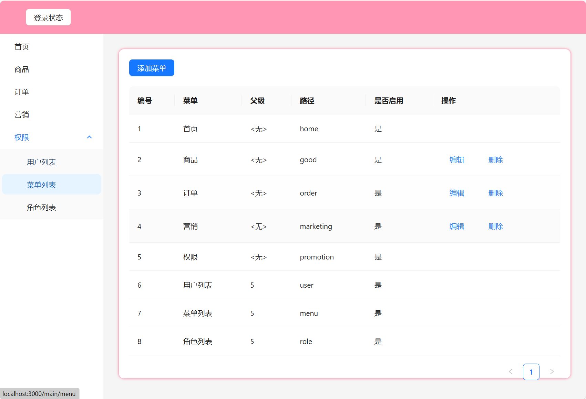
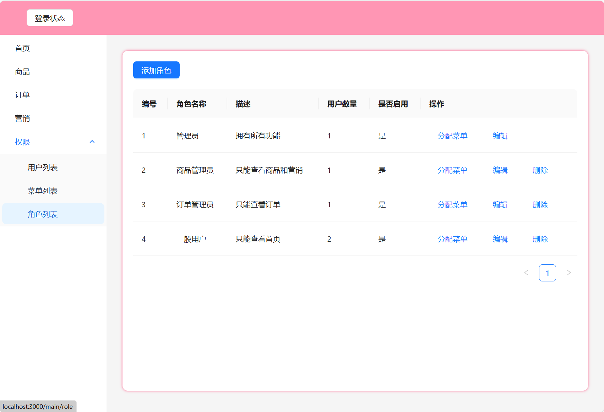

# XZ-MALL-WEB

**21301019-王彦博**

## 项目结构

```
    XZ-MALL-WEB/    /*省略了部分文件*/
    │
    ├── public/
    │   └── index.html
    │
    ├── src/
    │   ├── components/
    │   │   ├── menu/ 
    │   │   │   └── MenuEditModal.js
    │   │   ├── role/ 
    │   │   │   ├── RoleEditModal.js
    │   │   │   └── RoleMenuEditModal.js
    │   │   ├── user/ 
    │   │   │   ├── UserEditModal.js
    │   │   │   └── UserRoleEditModal.js
    │   │   ├── SideMenu.js
    │   │   ├── UserDropdown.js
    │   ├── contexts/
    │   │   ├── ServiceContext.js
    │   ├── hooks/
    │   │   ├── LoginCheck.js
    │   ├── pages/
    │   │   ├── CustomPage.js
    │   │   ├── GoodPage.js
    │   │   ├── HomePage.js
    │   │   ├── LoginPage.js
    │   │   ├── MainPage.js
    │   │   ├── MarketingPage.js
    │   │   ├── MenuPage.js
    │   │   ├── OrderPage.js
    │   │   ├── RegisterPage.js
    │   │   ├── RolePage.js
    │   │   └── UserPage.js
    │   ├── service/
    │   │   ├── MenuService.js
    │   │   ├── RoleService.js
    │   │   └── UserService.js
    │   ├── App.js
    │   ├── index.js
    │   └── router.js
    │
    ├── README.md
    ├── package.json
    └── .gitignore
```

### 各文件夹说明

1. **page 文件夹**：
   
    - **职责**：每个页面的逻辑和内容。
    - **分类**：
      - `CustomPage`为调试界面，为后续用户界面做准备
      - `LoginPage、RegisterPage`分别负责登录与注册
      - `MainPage`为一个容器界面，包含导航栏、侧边栏、内容区域，其他页面填充至内容区域
      - `UserPage、MenuPage、RolePage`分别为用户管理、菜单管理、权限管理页面（添加、删除逻辑）
      - `HomePage`为首页，`GoodPage、OrderPage、MarketingPage`无内容
    
2. **component 文件夹**：
   
    - **职责**：各个编辑弹窗的逻辑和内容，弹窗负责内容更改逻辑
    - **分类**：
      - `components/menu/*.js`提供菜单编辑弹窗
      - `components/user/*.js`提供用户编辑弹窗
      - `components/role/*.js`提供权限编辑弹窗
      - `components/SideMenu.js`提供侧边栏的显示服务，根据不同权限用户显示不同侧边栏
      - `components/UserDropdown.js`提供用户状态查询和注销功能
    
3. **service 文件夹**：
    - **职责**：将逻辑设计转化为服务类
    - **内容**： `service/*.js` 定义了各个服务类，通过类中的方法实现内容的编辑、显现等，与存储相关的localStorage直接交互

4. **contexts 文件夹**：
   
    - **职责**：整合给个服务，提供上下文，充当服务提供者。

    - **内容**： `ServiceContext.js`，它们使用 React 的 Context API 将服务类实例注入到组件树中，以便在任何组件中访问这些服务，通过下面引入方式，实现数据的增删改查
    
      ```
      import { ServiceContext } from "../contexts/ServiceContext";
      ```
    
    
    
5. **hooks 文件夹**：
   
    - **职责**：检查登录状态

6. **app.js**：

    - **职责**：定义整个应用全局配置。
    - **内容**：通常包含路由定义（使用 `react-router-dom` 等库），全局状态提供者（例如 `ServiceContext.Provider`），全局布局组件等。它是应用的核心配置文件，负责将不同的页面和组件串联起来。

7. **router.js**:
   
    - **职责**：定义整个应用的路由
    
8. **index.js**：

    - **职责**：应用的入口文件，负责启动整个应用。

    - **内容**：通过 `ReactDOM.render` 方法，将 `App` 组件挂载到 HTML 中的 `root` 节点，在 `index.js` 中，应用的全局样式和配置文件会被引入。

      

### 组件使用：Ant Design


## 运行及代码示例

执行 `npm intall` 完成环境配置

执行 `npm start` 在localhost:3000启动应用


#### **特别注意**：

使用`localStorage`来存储数据，编辑数据可被在浏览器缓存中长时间保存

若需要每次刷新启动恢复原始数据，将`index.js`中`// localStorage.clear();` 取消注释

这样每次启动时会清除缓存，各个service在读到空数据后会设定`default`数据


默认进入localhost:3000/main/home



点击左上方“登录状态”按钮，发现未登录状态，点击“登录”进入登录界面/login



点击注册，进入注册界面/register



注册会校验邮箱、密码格式，同时查询用户名是否存在，不可重名


注册界面 `RegisterPage.js` 中包含方法`isPasswordValid(password)`校验密码是否符合要求

```js
const isPasswordValid = (password) => {
    // 正则表达式，校验密码是否包含大小写字母和数字，且长度在8到16位之间
    const passwordRegex = /^(?=.*\d)(?=.*[a-z])(?=.*[A-Z]).{8,16}$/;
  
    // 使用正则表达式测试密码是否符合要求
    return passwordRegex.test(password);
  };
```

回到登录，使用管理员admin账号密码登录







点击各个按钮进入编辑操作

### 数据属性说明

1.菜单管理

```js
以首页和用户列表为例
	{
      id: 1,				// 菜单的序号
      name: "首页",			// 菜单的显示名称
      path: "home",			// 进入该菜单跳转的页面路由
      parent: 0,			// 父类菜单，无父类则为0
      enable: true,  		// 定义可见属性，默认可见，根据用户权限设置不同id菜单该属性不可见
    },
    {
      id: 6,
      name: "用户列表",
      path: "user",
      parent: 5,		// 父类菜单，父类是id为5的菜单
      enable: true,
      locked: true,
    },    
```

2.角色管理

```js
以管理员和商品管理员为例	
	{
      id: 1,						// 用户编号
      username: "admin",			// 用户名，登录标志
      email: "admin@bjtu.com",		// 用户邮箱
      password: "123456",			// 用户密码
      name: "管理员",					// 用户昵称
      role: [1],					// 用户权限等级，分为1-4级，下面“3.权限管理”会说明
      enable: true,					// 定义可用属性，默认不停用
    },
    {
      id: 2,
      username: "storeKeeper",
      email: "store@bjtu.com",
      password: "123456",
      name: "商品管理员",
      role: [2],
      enable: true,
    },
新添加的用户默认无权限等级，需要进行分配
```

3.权限管理

```js
	{
      id: 1,
      name: "管理员",
      desc: "拥有所有功能",
      menu: ["*"],			// 表示能查看的菜单id，“*”为全部
      enable: true,
    },
    {
      id: 2,
      name: "商品管理员",
      desc: "只能查看商品和营销",
      menu: [1, 2, 4],
      enable: true,
    },
    {
      id: 3,
      name: "订单管理员",
      desc: "只能查看订单",
      menu: [1, 2],
      enable: true,
    },
    {
      id: 4,
      name: "一般用户",
      desc: "只能查看首页",
      menu: [1],
      enable: true,
    },
```

